# 💎 Shahizewer – Full Stack Jewellery Ecommerce Website

## 📌 Project Overview

Shahizewer is a full-stack jewellery ecommerce platform developed using PHP, MySQL, HTML, CSS, JavaScript, and Bootstrap. The platform allows customers to browse jewellery products, manage carts, place orders, track orders, and book jewellery appointments.

The project also includes a complete admin dashboard where administrators can manage products, categories, customers, and orders.

This capstone project focuses on ecommerce workflows, responsive UI/UX design, authentication systems, database integration, and admin management functionality.

---

# 🚀 Customer Features

## 🏠 Modern Ecommerce Homepage
- Responsive luxury jewellery homepage
- Hero section with CTA
- Featured products
- Responsive navigation
- Mobile-friendly layout

## 🛍 Product Shopping System
- Product listing page
- Category-based filtering
- Product detail pages
- Dynamic product display from database
- Search functionality

## 🛒 Cart & Checkout System
- Add to cart
- Update cart quantity
- Remove items from cart
- Checkout form
- Order placement system

## 👤 User Authentication
- User registration
- User login/logout
- Session-based authentication
- Customer dashboard

## 📦 Order Tracking
- Track customer orders
- Order status updates

## 📅 Appointment Booking
- Jewellery consultation booking form
- Appointment request submission

## 📩 Contact System
- Contact form
- PHPMailer integration
- Email notifications

## 📱 Responsive UI/UX
- Mobile responsive design
- Tablet responsive layout
- Bootstrap-based UI
- Responsive ecommerce cards

---

# 👑 Admin Dashboard Features

## 🔐 Admin Authentication
- Protected admin pages
- Role-based access

## 📊 Admin Dashboard
- Admin control panel
- Dashboard navigation

## 💎 Product Management
- Add products
- Edit products
- Delete products
- Product categories management

## 📦 Orders Management
- View customer orders
- Update order statuses

## 👥 Customer Management
- View registered customers
- Customer details page

---

# 🧰 Tech Stack

## Frontend
- HTML5
- CSS3
- Bootstrap 5
- JavaScript

## Backend
- PHP
- PHPMailer
- MySQL
- PDO

## Tools
- XAMPP
- phpMyAdmin
- Git & GitHub
- VS Code

---

# 📂 Project Structure

```bash
assets/
 ├── css/
 ├── images/
 ├── js/
 └── screenshots/

auth/
db/
models/
views/
views/admin/

index.php
shop.php
product_details.php
cart.php
checkout.php
appointment.php
track_order.php
```

---

# 🗄 Database

Database file included:

```text
assets/shahijewer_db (2).sql
```

Import this SQL file into phpMyAdmin before running the project.

---

# ⚙️ Installation Steps

## 1️⃣ Clone Repository

```bash
git clone YOUR_REPOSITORY_URL
```

## 2️⃣ Move Project to XAMPP htdocs

```text
xampp/htdocs/
```

## 3️⃣ Import Database

- Open phpMyAdmin
- Create a new database
- Import SQL file

## 4️⃣ Update Database Credentials

Edit:

```text
db/database.php
```

## 5️⃣ Start XAMPP

Start:
- Apache
- MySQL

## 6️⃣ Run Project

```text
http://localhost/shahijewer_website
```

---
# 🎥 Project Demo

## 📺 Watch Full Project Demo Video

[▶ Watch Shahizewer Demo on YouTube][(https://youtu.be/BlaNXDHMxQg))

---

# 📸 Screenshots

## 🏠 Homepage


---

## 🛍 Product Search
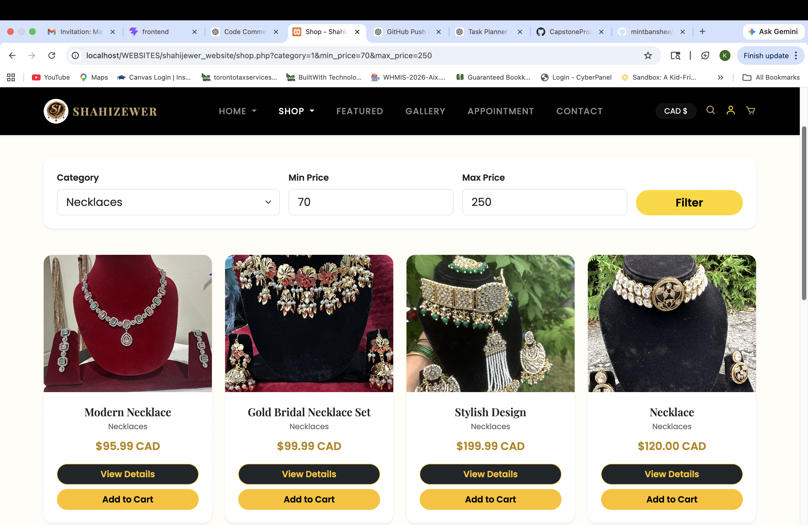

---

## 📦 Product Details
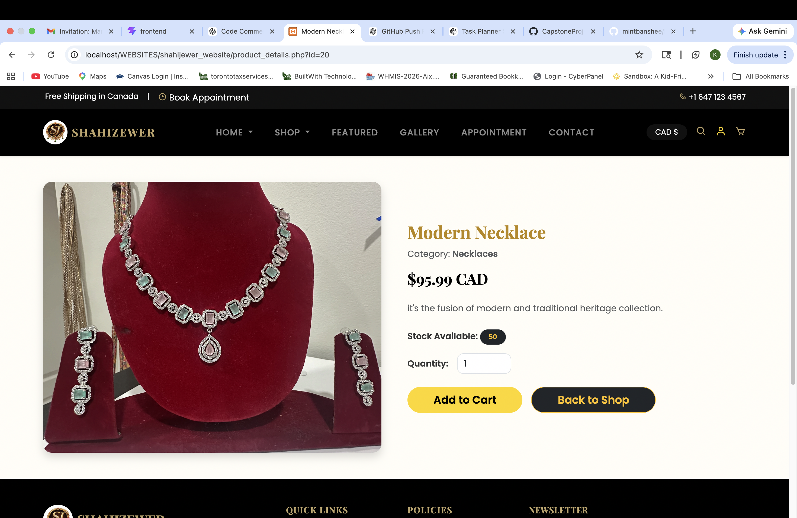

---

## 🛒 Cart Page
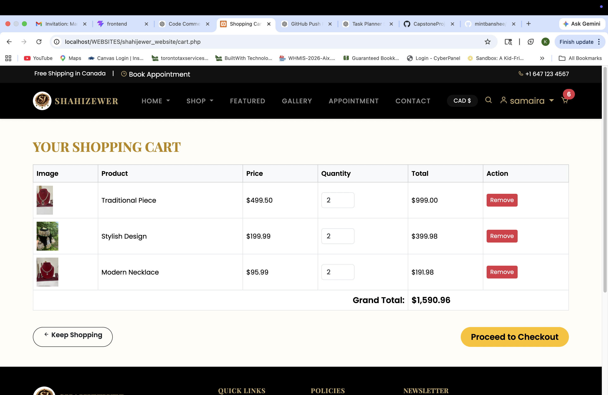

---

## 💳 Checkout Page
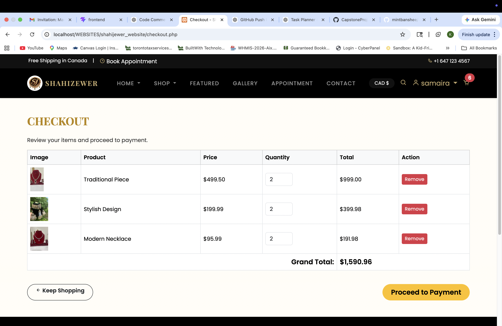

---

## 📅 Appointment Booking
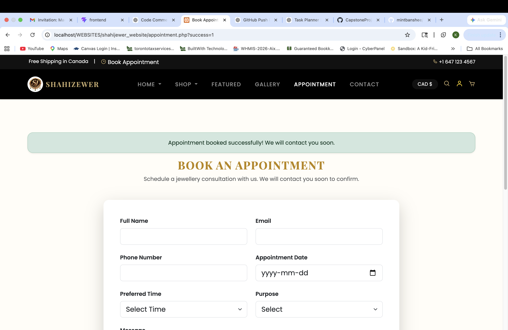

---

## 📩 Contact Booking
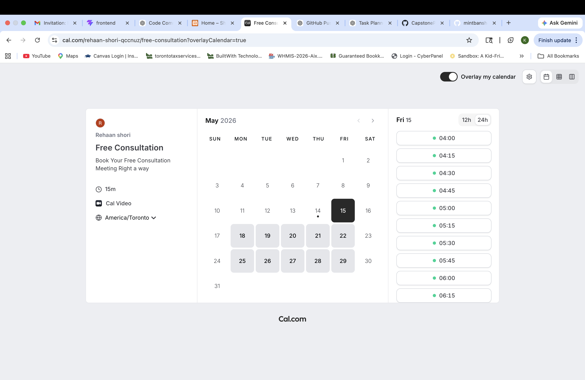

---

## 👤 User Dashboard
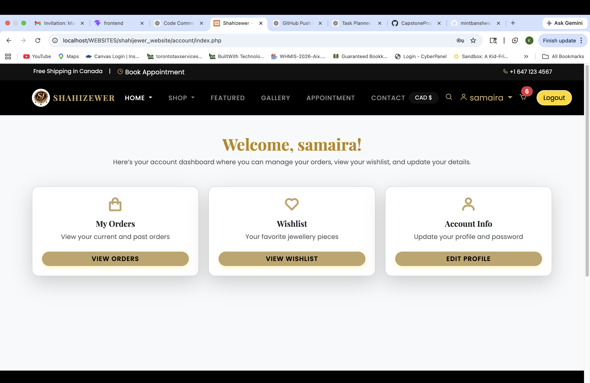

---

# 👑 Admin Dashboard

## 📊 Admin Dashboard
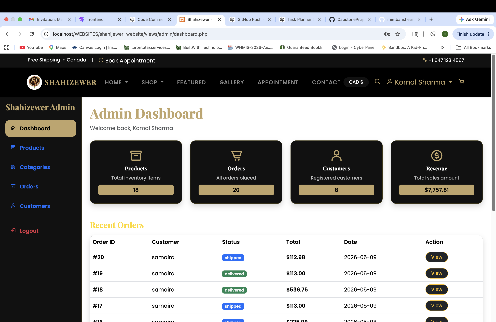

---

## ➕ Add / Delete Products
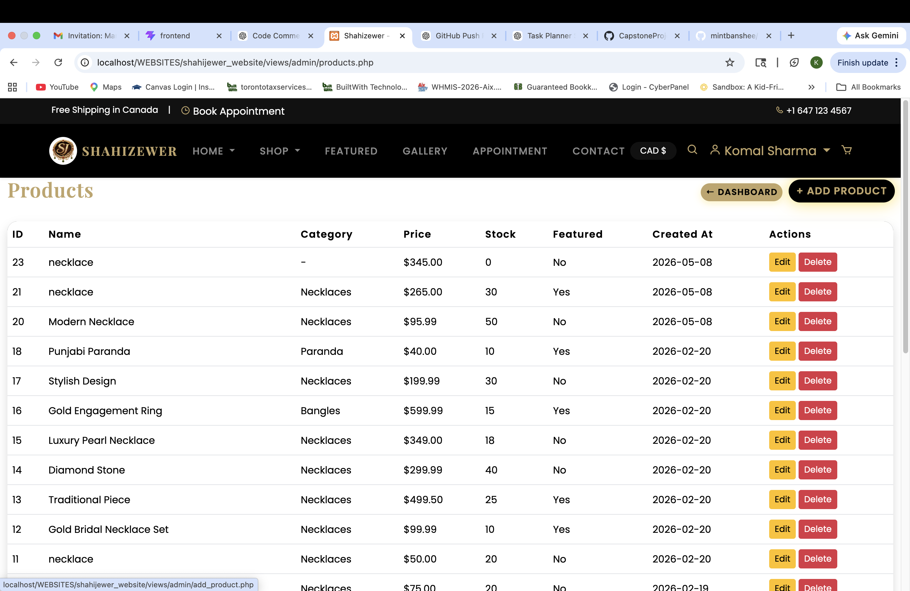

---

## 📦 Orders Management
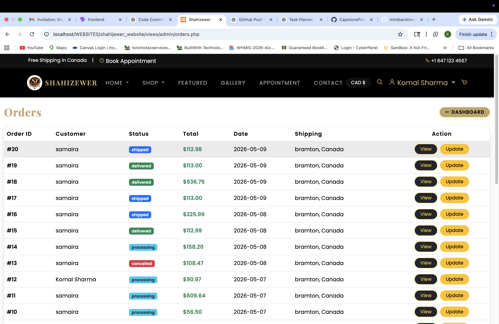

---

## 👥 Customers List
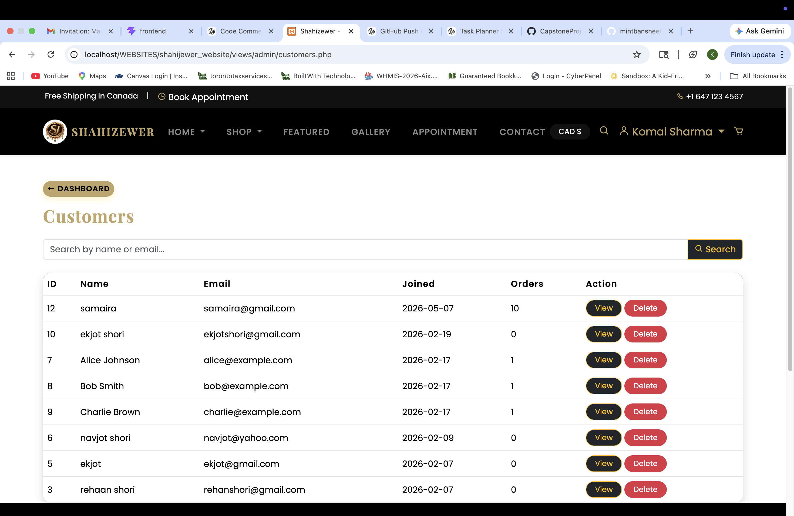

---

## 🔍 Customer Search
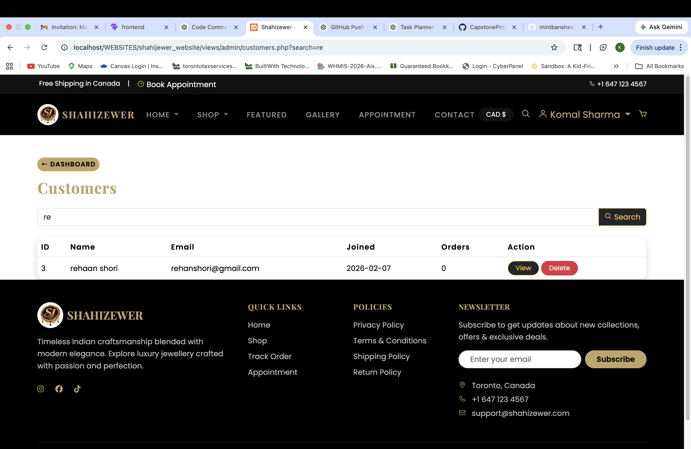

---

## 🧠 Learning Outcomes

Through this project I learned:

- Full-stack PHP ecommerce development
- CRUD operations
- Authentication systems
- MySQL database integration
- PHPMailer integration
- Responsive web design
- Ecommerce workflows
- Admin dashboard development
- Git & GitHub workflow
- Session handling in PHP

---
# 🤖 AI Usage Reflection

## How AI Was Used During Development

AI was used as a support and learning tool throughout the development of this project. It assisted with brainstorming UI improvements, debugging issues, improving responsive layouts, organizing components, and understanding Git/GitHub workflows. Rather than directly copying generated code, the suggestions were reviewed, modified, and adapted to fit the project requirements and overall application structure.

For example, AI was used to:
- Improve responsive navigation and layout structure
- Refactor sections for cleaner UI/UX
- Add reusable component comments and documentation
- Troubleshoot Git merge conflicts and GitHub push issues
- Improve README formatting and project documentation

## Understanding & Verifying the Code

All AI-assisted code and suggestions were tested and verified locally before being integrated into the project. Debugging tools, browser testing, and manual testing were used to ensure functionality, responsiveness, and compatibility across different sections of the application.

Several AI-generated ideas were modified to better match the project goals. For example:
- Dashboard/statistics sections were redesigned for a cleaner ecommerce UI
- Responsive layouts were adjusted manually for mobile optimization
- GitHub workflows and merge conflict resolutions were verified step-by-step before pushing changes

This process helped ensure that the final implementation was fully understood and correctly integrated into the project.

## Learning Outcomes From Using AI

Using AI throughout the project significantly improved both technical and problem-solving skills. It helped strengthen understanding of:
- Full-stack development workflows
- Git & GitHub collaboration
- Responsive web design
- Component organization
- Debugging and troubleshooting
- PHP and React project structure

Most importantly, AI helped improve confidence in analyzing, adapting, and improving code independently rather than simply copying solutions. The experience reinforced practical development skills and provided insight into real-world collaborative software development practices.

# 👩‍💻 Author

Komal Sharma

Full Stack Web Developer Intern

---

# 📄 License

This project was created for educational and portfolio purposes.
